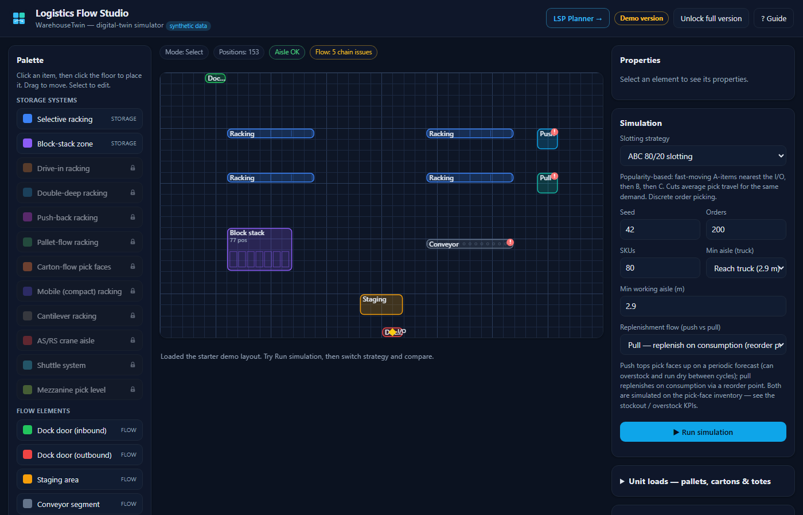
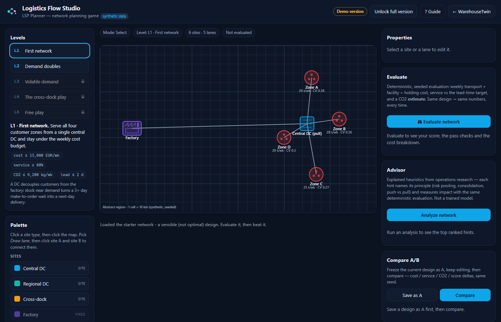

# Logistics Flow Studio — WarehouseTwin

WarehouseTwin is a small, honest **warehouse digital-twin simulator** you can play with in a browser. I built it to feel game-like and immediately usable: drop racks and dock doors onto a floor, pick a slotting strategy, hit **Run**, and watch the numbers move. It installs as an offline app and holds no company's IP — every icon and line of code here is original or permissively licensed, and every number is synthetic and seeded so you can reproduce it exactly.



Two numbers up front, both measured on the seeded starter demo layout and reproducible from [`docs/MEASUREMENTS.md`](docs/MEASUREMENTS.md): **ABC 80/20 slotting beats random by ~21%** on pick travel, and the one-click layout optimizer measured **36.70 → 18.85 m/order (−48.6%)** — synthetic data, deterministic, same seed → same result.

This is a multi-pass build, and all five passes are shipped: **Pass 1 (the foundation)**, **Pass 2 (the decision-support layer)**, **Pass 3 (domain depth)**, **Pass 4 (Android delivery + the demo/full tier gate)** and **Pass 5 (LSP Planner — the network-level planning game at [`lsp/`](lsp/), linked from the header)**.

## The engine counterpart

WarehouseTwin and LSP Planner are the **interactive layer** of a two-repo pair: game-like,
in-browser, teaching-scale what-ifs. The measured, test-gated sibling is
**[logistics-digital-twin](https://github.com/Dimitres-Kisimov/logistics-digital-twin)** — a Python
analysis engine with exact optimization (Hungarian-algorithm slotting, a CP-SAT optimality proof on
its small packing instance), discrete-event simulation, and CSV import for real SKU catalogs. Its
seeded benchmark reports container fill **2.0% → 30.2%**, pick travel **−44.2%**, and order cycle
time **−76.2%**; the numbers here (e.g. the −48.6% optimizer measurement) are teaching-scale
demonstrations on a starter layout, not comparable to the engine's benchmark. Reach for the engine
when you want batch analysis and provable numbers; stay here for intuition, teaching, and quick
what-ifs. A shared layout-JSON format between the two is **planned**, not built — today the repos
exchange no files.

## What it is

A single-page, no-build, no-framework PWA (Progressive Web App). Hand-written HTML, CSS and JavaScript. It runs fully offline and can be **installed** on a phone or desktop straight from the browser.

- **Interactive floor plan** on an HTML5 canvas. Place selective racking, block-stack zones, inbound/outbound dock doors, staging, conveyor, and push/pull control stations. Click to place, drag to move, everything snaps to a 1-metre grid, overlaps are blocked, and a **minimum working-aisle rule** (informed by DIN 15185) flags rack rows that sit too close.
- **A real-ish domain model.** EUR1–EUR6 euro pallets with their actual dimensions, carton types, and honest storage-system characteristics (footprint density, selectivity, FIFO/LIFO, a relative cost index). See `docs/DOMAIN_NOTES.md` for the numbers and their sources.
- **A seeded, deterministic simulation.** It builds a synthetic order stream, slots SKUs into your layout using **Random** or **ABC 80/20** slotting, simulates picking over the floor you drew, and reports live KPIs: throughput (orders/hr), average pick travel (m/order), storage fill %, and pallet positions used. The same seed always gives the same result.
- **Save / load / share.** Layouts persist in your browser and can be exported and imported as plain JSON. **Share layout link** (W2) copies a URL that carries the *whole design inside its `#layout=…` fragment* (base64url-encoded JSON, same schema as the export): the link **is** the data — nothing is uploaded, no server is involved, and browsers never even send the fragment over the network. Opening such a link rebuilds the layout locally through the same validation as JSON import; a malformed link shows an honest error toast and the app starts normally. Measured lengths: ~1.3k chars for the starter layout, ~2.8k for the MRO preset (`verify_share.js` prints the exact numbers).

### Pass 2 — decision support (new)

Four features that help you reason about a layout, all running offline on the same deterministic simulation:

- **Heuristic advisor.** A transparent rule engine (`advisor.js`) — *informed by operations-research and warehousing best practice, not a trained or black-box model*. It returns a ranked list of suggestions, and each one states the **finding**, the **principle** behind it, and an **estimated impact** measured with the real simulation where possible (e.g. "switching to ABC 80/20 is estimated to cut average pick travel ~21%" on the starter demo layout — pinned in [`docs/MEASUREMENTS.md`](docs/MEASUREMENTS.md)). Rules cover slotting strategy, the ABC golden zone, DIN 15185 aisle widths, dock/staging placement, and storage over-/under-utilisation.
- **Comparative A/B predictor.** Pick two configurations (e.g. Random vs ABC, or current vs optimised layout); it runs the sim twice at the same seed, shows the KPI deltas side by side, and names the better config in plain language. Deterministic.
- **Spatial-layout optimiser.** A one-click, deterministic "golden-zone" heuristic (`optimizer.js`) that proposes pulling storage closer to the outbound dock while keeping every aisle valid. It **previews** the move as dashed ghosts on the floor and shows the predicted KPI improvement via the sim — you accept or discard. It never mutates your layout until you apply it. Measured on the starter demo layout at the default settings: average pick travel **36.70 → 18.85 m/order, −48.6%** — pinned and reproducible headlessly via `node measure_optimizer.js` (see [`docs/MEASUREMENTS.md`](docs/MEASUREMENTS.md)).
- **German-standards panel.** A collapsible reference (ASR A1.8, DIN 15185, EN 15512, EPAL/DIN EN 13698, VDI 2510, VDI 3564, DIN EN 619, DGUV rules) with one line each on what the standard governs and how the app aligns — plus the **live DIN 15185 aisle check** as a concrete example. It carries a bold disclaimer that this is *guidance-aligned, not a certification or a legal-compliance guarantee.*

### Pass 3 — domain depth (new)

The full storage-systems palette, material-flow chains, and inventory dynamics — still one screen, still fully offline and deterministic:

- **Twelve storage systems**, each with honest, sim-relevant characteristics (footprint density, pallet positions, selectivity %, FIFO/LIFO rotation, relative cost, and a handling delta or machine cycle the simulation actually charges): selective racking, block-stack, **drive-in** (deep-lane LIFO), **double-deep**, **push-back** (LIFO), **pallet-flow** (true FIFO, presented pick faces), **carton-flow** (fast small-parts pick faces), **mobile/compact racking**, **cantilever** (long goods), **AS/RS crane aisle** and **shuttle system** (goods-to-person machine cycles instead of walking), and a **mezzanine pick level**. Distinct original canvas glyphs for each.
- **Material-flow chains.** Conveyors, staging, push/pull stations and the new **pack station** connect into validated chains (dock → staging → put-away → storage → replen → pick → pack → ship). Flow arrows show what is connected; broken chains warn (dangling conveyor, outbound dock with no pick feed, orphan stations); connected chains genuinely help in the sim (covered tours drop the return leg, chained legs save handling, chained receiving shortens pull lead time) while broken chains force manual travel.
- **Push vs pull, simulated.** A per-run toggle: push replenishes pick faces to a periodic forecast (with seeded forecast noise → overstock returns *and* dry spells between reviews); pull replenishes on consumption via reorder points and lead times. New KPIs: stockout % of lines, overstock returns, average face stock. Simplifications documented in `docs/DOMAIN_NOTES.md`.
- **Zone / batch / wave picking** joined random and ABC (zone = resident pickers per area + consolidation; batch = shared tours + sort; wave = timed release, bigger batches + setup). The A/B panel compares any two of the five — and is honest when shorter tours *don't* win on labour.
- **Unit-load catalog.** More cartons plus reusable totes, with **cartons-per-pallet math per EUR pallet type**; storage capacity is shown in pallet positions *and* estimated cartons.
- **One-click preset: "Industrial MRO distributor (illustrative)"** — a large layout (rack rows, deep-lane blocks, AS/RS aisle + shuttle, conveyor spine, push/pull stations, pack station, both docks) with an 80/20-skewed demand profile. *Independent, illustrative, based on public information about the industry segment — not affiliated with or endorsed by Würth or any real company.*
- **Advisor grew new rules**: broken-chain findings, LIFO-share vs FIFO-critical SKUs, carton-flow for high-velocity small parts, an AS/RS-needs-a-takeaway-conveyor check, and a **measured push-vs-pull comparison** using the same sim.

### Pass 4 — Android delivery + demo/full tiers (new)

- **Demo/full tier gate — honestly framed.** The app opens in a **demo tier**: the palette is limited to the starter six elements (selective racking, block-stack, both docks, staging, conveyor), slotting to Random + ABC, the MRO preset is locked, and the advisor shows its top 2 suggestions. Locked items are **never hidden** — they render greyed with an original padlock glyph and explain how to unlock. The header's **"Unlock full version"** button flips the tier. *Honesty note:* this is a **client-side showcase gate, not DRM** — it is a `localStorage` flag anyone can flip in DevTools, and the code says so. Its purpose is engineering demonstration: all gating flows through **one capability-flag module (`tiers.js`)** — palette, strategy selects, preset button and advisor read flags, no scattered if-statements — which is exactly the seam where a real deployment would plug in a license/purchase check (documented in `PUBLISH_ANDROID.md`). The gate never touches the simulation: the same config gives byte-identical KPIs in both tiers.
- **Android packaging scaffold** (`android/`): a pre-filled Bubblewrap `twa-manifest.json` (placeholder package id, colors/URLs matching the web manifest), a Digital Asset Links template, and a guide. Config and docs only — no AAB is checked in; building, signing and store submission are the owner's steps, walked through honestly in [`PUBLISH_ANDROID.md`](PUBLISH_ANDROID.md).

### Pass 5 — LSP Planner, the network game (new)

A second, self-contained app at [`lsp/`](lsp/) — **LSP Planner** — that zooms out from one warehouse to the whole logistics network. Same rules as everything else here: offline, deterministic, synthetic, original assets, honest labels.



- **An interactive network map** on an abstract grid region (1 cell = 10 km — *not* any real country or company network). Place factories, central DCs, regional DCs, cross-docks and customer zones; draw lanes between sites (click A, then B); drag to move, select to edit, delete, save/load per level, JSON export/import.
- **Two honest transport modes per lane.** Full truckload pays per truck (`ceil(flow / 15 t)` weekly trucks — a thin flow still pays a whole truck, which is exactly the lesson), Parcel/LTL pays per tonne-km. Each stocking DC has a **push vs pull replenishment toggle**.
- **A deterministic, seeded evaluation engine** (`lsp/lsp-engine.js`, pure — it runs identically in the browser and in Node). Customer zones carry seeded weekly demand (mean + variability); one click computes weekly transport cost, facility fixed + handling cost, **holding cost with safety stock via the textbook base-stock / square-root risk-pooling formula** (`SS = z·√LT·σ_pooled`), achieved service against a lead-time target, and a **CO2 estimate** with its per-mode assumptions stated. Same design → identical numbers, every time.
- **Game scoring + five levels.** A 0–100 score with visible weights (cost 45% / service 40% / CO2 15%), stars, and per-level pass/fail thresholds: L1 serve four zones from one DC; L2 demand doubles and the risk-pooling trade-off appears; L3 volatile demand where **pull measurably beats push**; L4 thin balanced flows where **a cross-dock pays off**; L5 free play with the full palette. Level budgets were calibrated against reference designs (the in-app "Starter" networks) by the verification harness `lsp/verify.js` — which also proves determinism and both level lessons on every run.
- **Comparative A/B + advisor.** Freeze design A, keep editing, diff cost/service/CO2/score with a plain-language winner line. The advisor is the same species as WarehouseTwin's: explained heuristics that *name their principle* (square-root law of risk pooling, transport consolidation, push vs pull fit, cross-dock flow balance) with impacts measured by the same deterministic evaluation — capped at the 4 most relevant.
- **Shared tier gate.** The same `tiers.js` module gates the levels: demo plays L1–L2, L3+ render with the padlock and the honest unlock hint.

### Round 2 — seeing the walking, keeping the experiments (new)

Two additions from the post-release audit, aimed at how a planner actually iterates:

- **Pick-travel heatmap.** A **Heatmap** toggle above the floor shades every 1 m cell by the metres the simulated picker(s) walked through it in the last run — so the golden-zone/ABC lesson is something you *see* (traffic piling up near the outbound dock), and an optimizer proposal can be judged by where the walking goes, not just by two numbers. It is computed from the exact tour legs the travel KPI charges and **sums to the travel KPI to floating-point precision** (asserted for all five picking strategies by `node verify_heatmap.js`). Honest edges: tours are straight-line (as in the whole sim), goods-to-person picks add no walking so AS/RS/shuttle layouts stay deliberately blank, and the legend flags the overlay as **stale** when the layout or settings change after the run.
- **Run history.** Every Run appends a row — config summary (strategy, flow, seed, orders/SKUs, positions) plus the headline KPIs (pick travel, throughput, fill, stockouts, labour EUR/order) — newest first, with the best travel and throughput so far marked. Runs triggered by applying the optimizer are tagged. It is **session-only by design**: rows describe layouts that may no longer exist, so the log is not persisted with the layout. Same seed and setup → an identical row, like everything else here.

## Use your own warehouse

Two W3 features turn the teaching twin into a tool you can point at a *real* operation — both **full-version** features (visible with a padlock in the demo), both **100% in-browser** (FileReader; the app makes zero network requests, so nothing *can* be uploaded anywhere):

- **Import your data (CSV).** Feed the sim your own article list — `sku,description,weekly_picks[,class]` — and optionally your own order lines — `order_id,sku,qty`. Your `weekly_picks` become the real demand velocities (no Zipf assumption), ABC classes are recomputed with the standard 80/20 split from *your* picks unless you supply the `class` column, and when you import orders the sim **replays exactly those orders**. Validation is row-numbered (missing columns, non-numeric values, duplicate SKUs, unknown SKUs in orders, …) and a failed import changes nothing. The data badge above the floor switches honestly between **"Data: synthetic demo"** and **"Data: yours"**, and the KPI footnote states exactly which parts are your data and which stay model assumptions. Caps: 2 000 articles, 20 000 order lines, 2 MB per file. **What stays synthetic even with your data:** pallet counts per SKU (not in the CSV — a seeded model draw), picker speed/handling times, and — if you import no orders — the order stream itself (seeded draws weighted by your real pick frequencies; the UI says so). The advisor, optimizer, A/B compare and heatmap all run on the imported dataset unchanged, and determinism holds: same CSVs + seed → identical KPIs (`node verify_data.js`).
- **Floor plan underlay.** *From a picture to a working layout:* load a photo or plan of your hall (≤ 4 MB image) and it is drawn **under** the grid with an opacity slider and a hide toggle. Calibrate the scale by clicking **two points** on the image that are a known real distance apart and typing that distance — two dock doors, a rack row — and the image rescales onto the 1 m grid (chosen over a blind scale slider because a photographed plan has no known pixel scale; the two-point gesture calibrates it exactly, once). **Align** mode drags the image into position. Then trace: place racks and docks over the plan as usual.
- **Privacy, honestly stated.** Imported data and the plan image live in *this browser's* localStorage only (the image up to a ~1.9 MB cap — larger plans stay session-only with a warning) and are **excluded from share links by default**: a share link carries the layout + settings only and opens on the synthetic demo dataset — the share toast says so whenever your data is active. "Reset to demo data" restores the seeded world at any time.

## Export to BIM (IFC)

The layout doesn't have to stay inside this app: **Export IFC (BIM)** (Layout panel, full version — padlocked in the demo) downloads the current floor as an **IFC4** file in the ISO 10303-21 STEP encoding — the exchange language every German planning office and BIM tool reads. This continues the heritage of my finished flagship, **SCS Studio — 3D Picture → IFC Modeling** (photo → AI 3D → IFC4 buildings): there the pipeline ends in IFC, here the warehouse twin speaks it too, so a layout designed in the browser lands directly in the BIM world.

Scope, honestly: **a scoped IFC4 export — elements as proxy solids for coordination/viewing; not full BIM authoring.** Concretely:

- **Spatial tree:** `IfcProject → IfcSite → IfcBuilding → IfcBuildingStorey`, SI units in **metres**, world coordinates at the grid origin (a top-down view matches the app's floor view).
- **One `IfcBuildingElementProxy` per placed element:** named `<type> <id>`, placed by `IfcLocalPlacement` from its grid position (the grid has no rotation, so placements are pure translations), with a Body of `IfcExtrudedAreaSolid` — the element's **real footprint** extruded to a **per-type height that is an assumption** (declared as `heightM` in `domain.js` and flagged `HeightIsAssumption` in the file itself).
- **`WT_ElementType` property set on every proxy:** element type, category, the assumed height, pallet positions and — for storage — a **VelocityClass** (A/B/C) *derived* from the ABC distance-to-I/O ranking the simulator teaches (an assumption, labelled as such in the property's description).
- **Written from scratch, dependency-free:** [`ifc.js`](ifc.js) is a hand-rolled STEP serializer — no library, no WASM, no network — so the export works offline like everything else, and the whole entity graph is auditable in one file.

Validation is two-layered: `node verify_ifc.js` (harness 6 of 7 in `node test/run-all.mjs`) checks the files **structurally** — STEP framing, every `#ref` resolving, entity counts matching the layout one-to-one, GlobalId rules, string escaping, byte-identical determinism — and then, as the **gold standard**, opens both exports with [ifcopenshell](https://ifcopenshell.org/) via `tools/validate_ifc.py`, asserting schema and entity counts (this step **skips with a printed note** on machines without Python/ifcopenshell; the structural checks always run). Viewer-testing is left as a user step — free options: **BIMvision**, **usBIM.viewer**, **Open IFC Viewer**.

## Compliance Check

A **Compliance Check** panel (right column) reviews the current layout against **published German workplace-guideline values** and returns a structured pass / warn / fail report. It is the practical answer to a gap I kept finding: layout planners optimise for throughput and density, while workplace-safety rules live in a separate document — so the check brings a first, honest read of those rules *into* the planning canvas.

What it looks at, each **informed by** a named guideline (with the guideline's published guidance value, **not** a binding limit):

- **Working aisle width** — *informed by* **DIN 15185** — every facing rack-row gap against the minimum working aisle for the selected truck class (VNA / reach / counterbalance). Reuses the *same* aisle definition as the canvas, advisor and optimiser (`domain.js` `facingAislePairs` / `aisleViolations`), so there is one definition of "too narrow".
- **Main traffic route** — *informed by* **ASR A1.8** — the clear run of the main route in front of each dock door (transport-means envelope + lateral safety clearances). A dock feeding directly into staging or a conveyor is the *designed* material flow, so connectors are treated as passable, not as an obstruction.
- **Escape route** — *informed by* **ASR A2.3** — reachability (does every storage element have a free-floor path to an exit, or is it boxed in?), route width at the tightest passage, and travel distance to the nearest exit.
- **Blocked route** — a dock door sealed shut by a rack so nothing can pass through it.

Each finding carries the **measured value**, the **informed-by guidance value**, the **offending element id(s)** and a plain-language **DE + EN** explanation; click a finding to highlight those elements on the floor. The report is **deterministic and pure** (`compliance.js` — same layout in, byte-identical report out) and runs fully offline.

Framed honestly, and non-negotiably: this is **a design aid, aligned to / informed by German workplace guidelines — explicitly NOT a certification, a legal-compliance guarantee, or a Gefährdungsbeurteilung (risk assessment).** The banner sits at the top of the panel and the same disclaimer (DE + EN) is embedded in every report, so a screenshot or logged report can never be mistaken for a certificate. The escape/traffic/blocked checks are geometric **heuristics** over a 1-metre occupancy grid (docks = exits, other elements = walls); they approximate egress logic, not a fire-safety or building-code assessment. Validated by `node verify_compliance.js` (harness 7 of 9 in `node test/run-all.mjs`): hand-built layouts assert the exact pass/warn/fail outcomes and measured/informed-by numbers, determinism, and that the not-a-certification disclaimer is present in the output.

## AI Environment Generator

The **Generate Environment (AI)** panel (top of the left column) builds an entire valid warehouse/plant layout from a plant profile, then lets you steer it with plain-language instructions.

**Honest framing (mandatory, in the UI and here):** this is an **AI-assisted generative layout — a deterministic rule/heuristic engine plus offline natural-language command parsing; it runs entirely in your browser, no cloud, no trained black-box model.** A generated baseline is **a best-practice-informed starting point, not an engineered or certified plan.** Every generated layout is checked against the same ASR/DIN guidance as the rest of the app (`compliance.js`) — *informed by, not a certification.* No GPU, no network, no new dependencies; it works on a normal laptop, fully offline, from `file://`.

**Four plant profiles** (pinned keys the companion Python engine mirrors) — each with its own zone mix (receiving / storage / picking / packing / shipping), racking systems, minimum working aisle, dock counts and typical automation:

- `ecommerce-fulfilment` — carton-flow + mezzanine small-item picking, an **AGV/AMR** spine + conveyor sortation, few in / many out docks, batch picking.
- `spare-parts-distribution` — dense narrow-aisle (VNA) selective + shuttle small-parts + carton-flow, an **RGV** transport lane, zone picking on a very high SKU count.
- `automotive-supply` — selective + pallet-flow + drive-in, an **RGV** transport spine feeding line-side pick faces, wave picking, many balanced JIT docks.
- `cold-chain` — mobile (compact) racking + drive-in for density in the cooled volume, carton-flow pick faces, few insulated docks, push replenishment.

`generateLayout(profileKey, {gridW, gridH, seed})` is **deterministic and seeded** — the same profile + seed yields byte-identical JSON — and the result is **overlap-free** and **passes (or at worst honestly warns)** the compliance check on the app's 40×24 m floor. Two new **transport** elements back the automation: `rgv` (rail-guided-vehicle lane) and `agv` (AGV/AMR route). Both are honest movement elements — they occupy floor like an aisle but hold **zero** storage capacity.

**Three modes:** **Auto** (AI builds the whole environment), **Guided** (build a baseline, then refine it with typed commands) and **Manual-reserve** (build it, but leave the picking sector empty and visibly marked *reserved for manual expansion*).

**Steer it in plain language** (offline, deterministic parser — `nlcommands.js`). Supported phrasings, each returning a structured op + a plain-language echo in the action log:

| You type | It does |
|---|---|
| `include 2 more RGVs in the picking sector` | adds exactly +2 RGV lanes to the picking zone |
| `leave zone picking for manual expansion` | empties the picking zone and marks it reserved |
| `use the cold-chain baseline` | regenerates from that profile |
| `remove the conveyor in packing` | removes that element from that zone |
| `widen the main aisle to 4 m` | widens the working aisle and re-flows the baseline |

Zone synonyms (`picking sector` / `pick area` / …) and element/number words are handled. **Unknown or ambiguous input is answered honestly** — `add 3 RGVs` with no zone, or gibberish, returns a *"couldn't understand / did you mean…"* with the list of what the parser supports. It **never silently guesses**.

The floor is laid out as flow bands (a 2-cell clear buffer keeps the escape network off the perimeter walls):

```
row 0        docks-in  · · ·                         (receiving)
rows 2–3     staging blocks under the docks          (receiving)
rows 6…      full-width rack rows, one working aisle apart   (storage)
             an RGV/AGV transport spine              (picking)
             pick-face rows                          (picking)
rows H-5,-4  pack stations   ── conveyor spine ──    (packing)
row  H-1     docks-out · · ·                         (shipping)
```

Validated by `node verify_generate.js` (harness 8 of 9): the four pinned profile keys, `rgv`/`agv` as 0-capacity transport, byte-identical determinism per profile+seed, every profile overlap-free and passing/warning (never failing) compliance, the three modes, and the NL parser (the pinned `include 2 more RGVs in the picking sector` → +2 rgv, reserve / regenerate / widen / remove, and an honest not-understood on unknown input). Engine in `generate.js` (`WT.generate`), parser in `nlcommands.js` (`WT.nl`).

## Design philosophy

I wanted the opposite of a dense enterprise tool: something a newcomer can understand in under a minute. So the whole app is one screen — palette on the left, floor in the middle, properties and the simulation on the right — with a three-step onboarding card and tooltips on every palette item. The goal is **radically intuitive and game-like**: you learn the domain by playing with it, not by reading a manual.

## The domain it models

This is genuine warehouse/intralogistics territory, kept deliberately simple for Pass 1:

- **Storage systems:** selective (single-deep) pallet racking vs. floor block-stacking — a classic selectivity-vs-density trade-off.
- **Flow elements:** receiving and shipping docks, staging/marshalling, conveyor, and **push vs. pull** control points (forecast/schedule-driven replenishment vs. demand/kanban-driven movement).
- **Slotting:** random placement vs. ABC 80/20 (Pareto) placement, where fast-moving A-items go closest to the I/O point to cut travel.
- **Aisle design:** a single configurable minimum working-aisle width between facing rack rows, informed by DIN 15185 truck-aisle guidance.

Details and citations live in [`docs/DOMAIN_NOTES.md`](docs/DOMAIN_NOTES.md).

## How to run

It's static — no server or build step required.

- **Simplest:** open `index.html` in a modern browser. Everything works, including the canvas, the simulation, and save/load.
- **Deep-links:** append `?tour=off` to either app's URL to skip the intro tour (and, LSP Planner only, `?demo=1` to load the level's starter network) — handy for demos and screenshots. Share links use the *fragment* (`#layout=…`), so they combine freely with the query flags: `index.html?tour=off#layout=…` skips the tour *and* loads the shared design. After loading, the app clears the fragment from the address bar so a refresh keeps your subsequent edits instead of re-applying the link.
- **As a full PWA (recommended):** service workers need `http(s)`, so serve the folder:
  ```
  python -m http.server 8000
  ```
  then visit `http://localhost:8000/`. Now it precaches itself and works offline, and the **Install app** button lights up when your browser offers installation. (The button is always visible; opened from `file://` or in a browser without PWA install prompts, clicking it explains exactly what is missing instead of silently hiding.)

## Install on Android

**Now, as a PWA (zero cost):**

1. Serve the folder over http(s) (or host it) and open it in Chrome on Android.
2. Use the **Install app** button in the header, or the browser menu → **Install app / Add to Home screen**.
3. It installs with its own icon and launches standalone, fully offline.

**Play Store path (TWA wrap):** the packaging scaffold ships in [`android/`](android/) — a pre-filled Bubblewrap config and a Digital Asset Links template. The complete step-by-step (hosting the PWA, building the signed AAB, the $25 developer account, store submission — with every owner-only step marked) is in [`PUBLISH_ANDROID.md`](PUBLISH_ANDROID.md). No built AAB is included: signing and submission belong to the app owner.

## Honesty notes

- **All data is synthetic and seeded.** There is no real inventory, no real order history, no telemetry. Nothing leaves your device — there are zero runtime network calls.
- **All assets are original or open.** Icons are SVG I drew (and rasterised with a small Python/Pillow script); the font is your system font stack; there are no third-party logos, images, or trademarks. See [`CREDITS.md`](CREDITS.md).
- **"Informed by / aligned to", not certified.** The aisle rule is *informed by* DIN 15185 and the pallet sizes follow EPAL/UIC references, but WarehouseTwin performs **no compliance certification** of any kind. The advisor, standards panel and the **Compliance Check** (ASR A1.8 / ASR A2.3 / DIN 15185) are design aids — explicitly **not** a certification, a legal-compliance guarantee, or a Gefährdungsbeurteilung. The guideline figures shown are published guidance values, not legally binding limits, and a passing check does not mean a layout is compliant.
- **No superlatives.** It's a teaching twin, not a WMS. I make no "best/patented/superhuman" claims, and the shipped UI doesn't name or knock any specific commercial product.

## Roadmap

All five passes are shipped:

- **P1 — Foundation. ✅ Done.** PWA shell, interactive canvas, domain model, seeded simulation, KPIs.
- **P2 — Advisor + comparative + optimiser + standards panel. ✅ Done.** A heuristic (rule-based, explainable) layout advisor, an A/B predictor that runs two configurations and diffs the KPIs, a spatial-layout optimiser that pulls storage into the golden zone to cut pick travel, and a German-standards panel with a live DIN 15185 aisle check — all *informed by*, not certified. See `advisor.js`, `optimizer.js`, and the Pass 2 panels in the app.
- **P3 — Domain depth. ✅ Done.** All twelve storage systems with sim-relevant characteristics (selectivity, FIFO/LIFO, handling deltas, goods-to-person cycles), validated material-flow chains with flow arrows and broken-chain warnings, simulated push-vs-pull pick-face inventory (stockouts vs overstock), zone/batch/wave picking, the carton/tote catalog with cartons-per-pallet math, and the illustrative MRO-distributor preset. Every model simplification is written down in `docs/DOMAIN_NOTES.md` — it remains a teaching twin, not a WMS.
- **P4 — Android delivery + tiers. ✅ Done.** The demo/full tier gate (`tiers.js` — one capability-flag module; locked items visible with an original padlock, honestly documented as a showcase gate, not DRM) and the Bubblewrap/TWA packaging scaffold (`android/` + the rewritten `PUBLISH_ANDROID.md`). Docs and config only on the store side — the signing key, developer account and submission are the owner's, marked as such.
- **P5 — LSP Planner. ✅ Done.** The network-level planning game at [`lsp/`](lsp/): abstract-region map editor (sites + lanes, FTL vs Parcel/LTL, push/pull per DC), a pure deterministic evaluation engine (transport/facility/holding cost with base-stock safety stock and square-root risk pooling, service vs a lead-time target, labelled CO2 estimates), five scored levels with honest calibrated thresholds, A/B compare, a principle-naming advisor, the shared demo/full tier gate, and a Node verification harness (`lsp/verify.js`) that proves determinism and the L3 (pull beats push) and L4 (cross-dock pays off) lessons. Model simplifications are documented in `docs/DOMAIN_NOTES.md` §9.
- **Round 2 — heatmap + run history. ✅ Done.** The pick-travel heatmap overlay (per-cell walked metres from the same simulated tours, conservation-checked by `verify_heatmap.js`, method in `docs/DOMAIN_NOTES.md` §7b) and the session-only run-history table.
- **W2 — shareable layout links. ✅ Done.** The remaining half of the "save-slots + shareable links" item (run history covered the first half): `share.js` encodes the full layout as JSON → UTF-8 → base64url into the URL's `#layout=…` fragment, decoded on boot through the same validation as JSON import. 100% offline — the link *is* the data; nothing is uploaded. Round-tripped and length-measured by `verify_share.js`.
- **W3 — real-world usability: your data + your floor plan. ✅ Done.** The CSV importer (`data.js` + the "Import your data" panel; row-numbered validation, honest synthetic-vs-yours labelling, sim/advisor/optimizer/A-B all running on the imported dataset, verified by `verify_data.js`) and the floor-plan image underlay with two-point scale calibration, align/opacity/hide controls and a localStorage size cap. Both full-tier, both offline, both excluded from share links — see "Use your own warehouse" above.
- **W4 — Export to BIM (IFC). ✅ Done.** The dependency-free IFC4 (STEP) export bridge — `ifc.js` plus the "Export IFC (BIM)" button — validated structurally by `verify_ifc.js` and, as a gold standard, by ifcopenshell. See "Export to BIM (IFC)" above.
- **W5 — Compliance Check. ✅ Done.** A workplace-guideline-aware layout review: `compliance.js` returns a deterministic, structured pass/warn/fail report (working aisles *informed by* DIN 15185, main traffic routes ASR A1.8, escape-route reachability/width ASR A2.3, blocked-route detection), each finding carrying measured + informed-by numbers, offending element ids and a DE/EN explanation. Wired to the "Compliance Check" panel with click-to-highlight and a prominent not-a-certification banner; verified by `verify_compliance.js`. Explicitly a design aid, **not** a certification or Gefährdungsbeurteilung. See "Compliance Check" above.

## Licence

© 2026 Dimitres Kisimov — all rights reserved; published for portfolio review. See LICENSE.
